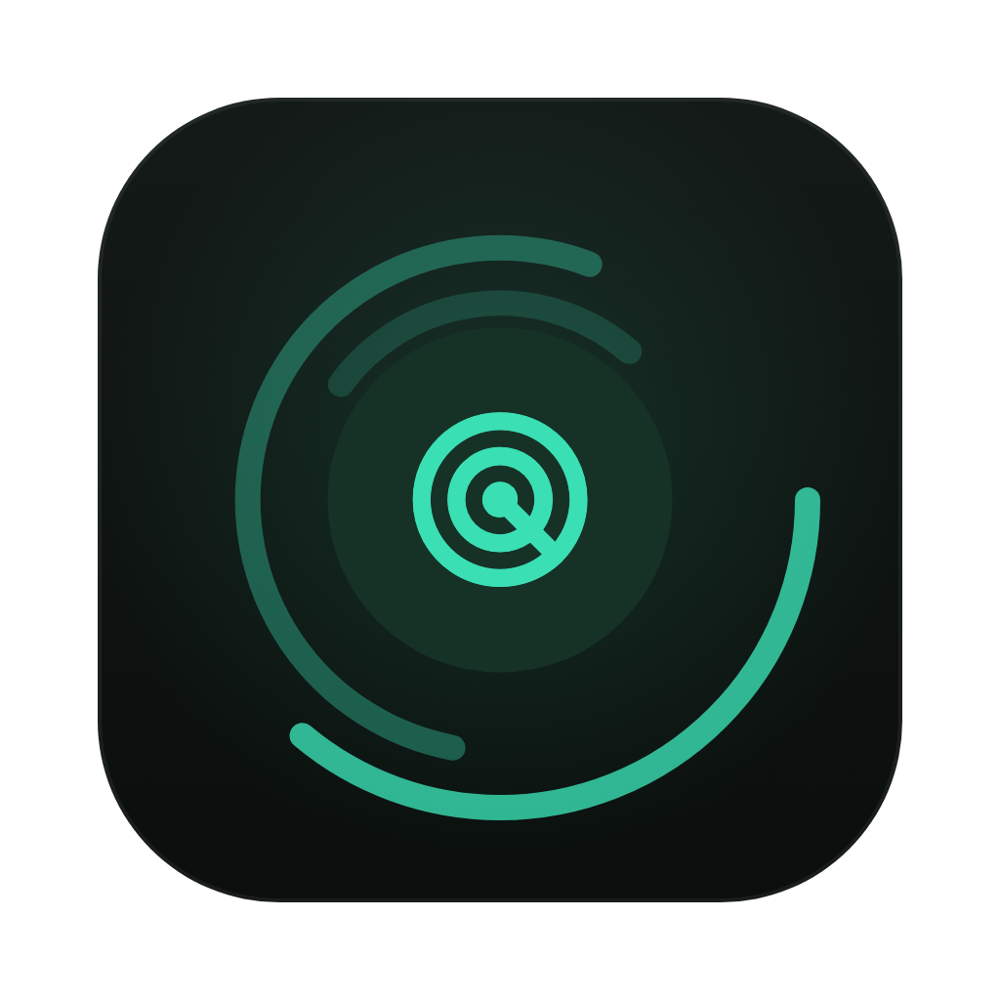
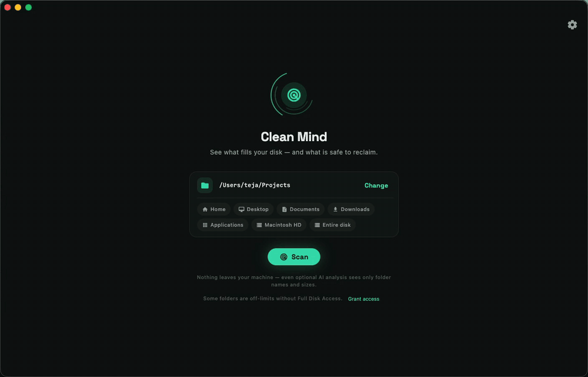
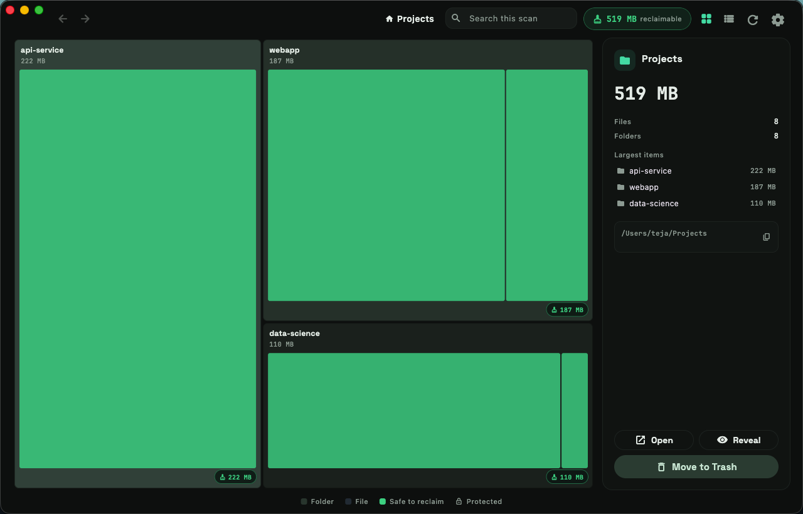
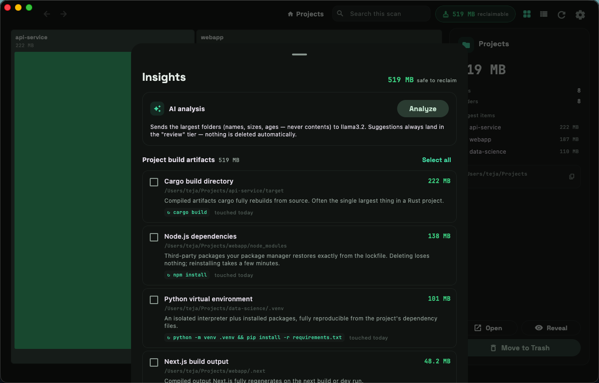

<div align="center">



# Clean Mind

**See what fills your disk — and understand what's safe to reclaim.**

[](https://github.com/MS-Teja/clean-mind/actions/workflows/ci.yml)
[](https://github.com/MS-Teja/clean-mind/releases/latest)
[](LICENSE)

**Private by design · Knows what's safe · Native on every desktop**

```sh
brew install --cask MS-Teja/clean-mind/clean-mind
```

<sub>macOS · [Windows and Linux installs](#install) below</sub>

</div>

Clean Mind is a fast, private, open-source disk analyzer in the spirit of DaisyDisk and OmniDiskSweeper — except it doesn't stop at showing *what* takes space. It tells you what's safe to delete, *why*, and the exact command that brings each item back. It goes deepest on a developer's disk — package caches, build artifacts, stale `node_modules`, old simulators — and the agentic-coding era makes that matter more than ever: spin up a few throwaway repos a day with a coding agent and you accumulate `node_modules`, build caches, and `.venv`s faster than you can track them. Almost all of it is regenerable; the hard part is knowing which.



## 🧠 It knows what's safe — and tells you why

Every "cleaner" shows you where the space went, then leaves you to guess whether deleting a folder will wreck a project. Clean Mind's deterministic rules engine recognizes `node_modules`, cargo `target/`, Xcode DerivedData, package-manager caches, and more across every major ecosystem — on macOS, Linux, and Windows alike — and for each one explains why it's safe and prints the command that regenerates it.

The trust model has three tiers, and the LLM is never trusted on its own:

1. **Safe · regenerable** — confirmed by the rules engine (e.g. `node_modules` next to a `package.json`). One-click reclaim.
2. **Review** — AI suggestions no rule verifies. Always shown with reasoning, never one-click.
3. **Protected** — a hard denylist (documents, photos, `.ssh`, system paths…) that neither rules nor AI can override.

Deletions go to the OS Trash and are recoverable; permanent delete exists only behind a type-to-confirm gate. Nothing is ever deleted automatically.

## 🔒 Your disk is your business

Privacy isn't a settings toggle here — it's the architecture:

- **Everything runs on your machine.** No telemetry, no account, no bundled inference, no background service. Scan results live only in memory; nothing is cached to disk.
- **AI is strictly opt-in, and it's *your* AI.** Bring your own Anthropic or OpenAI-compatible key, or run fully local with Ollama. It only ever sees directory *metadata* — names, sizes, ages — never file contents.
- **Pseudonymization goes further:** turn it on and the model doesn't even learn your folder names. Personal names become `dir-1`, `dir-2`, … before anything leaves your machine (structural names like `node_modules` stay readable so the analysis still works), and answers are mapped back to your real folders locally.
- **API keys live in the operating system keychain** — never in config files.

## ⚡ Native on every desktop

One parallel Rust core and one Flutter UI ship a real desktop app — not a web view — on **macOS, Linux, and Windows**, x64 and arm64 alike:

- The rayon-powered scanner walks over a million files in seconds, measures true on-disk size (hardlink- and APFS-clone-aware), and streams progress live.
- Small install (~60 MB), low memory, zero idle cost: no Electron, no daemon.
- Each platform gets its own conventions: Trash vs Recycle Bin, per-platform volumes, long-path support on Windows, native installs via Homebrew, Scoop, or `apt`.

And the explorer you'd expect around it: a squarified drill-down treemap, a sortable list view, whole-scan search, back/forward navigation, and drag-and-drop any folder to scan it.

## Screenshots

An interactive treemap sizes every tile by how much space it takes; green tiles are safe to reclaim.



The insights panel groups reclaimable items and, for each one, explains *why* it's safe and the exact command that regenerates it.



<sub>Captured on macOS; the same UI runs natively on Linux and Windows.</sub>

## How it works

- **Scan** — a fast parallel Rust scanner walks your home directory (or any path — pick a smart location, or drag a folder onto the window). Fresh scan every launch.
- **Understand** — an interactive treemap or sortable list shows where the space went; search the whole scan by name.
- **Classify** — the rules engine marks known developer artifacts by how safely they regenerate.
- **Ask** *(optional)* — an aggregated, metadata-only view of your largest directories goes to the LLM *you* configure, which explains what can go and why.
- **Clean** — reclaim to the Trash with one click; restore from there if you ever change your mind.

## Install

All downloads are on the [latest release](https://github.com/MS-Teja/clean-mind/releases/latest) page. Every platform ships x64 and arm64.

**macOS — Homebrew (recommended):**

```sh
brew install --cask MS-Teja/clean-mind/clean-mind
```

Or download the universal DMG and drag **Clean Mind** to Applications. The app isn't notarized, so the first launch needs one extra step — macOS 15+: open once, then **System Settings → Privacy & Security → Open Anyway**; earlier: right-click → **Open**. When macOS asks for folder access on the first scan, that's the normal per-folder prompt; grant **Full Disk Access** for complete results.

**Windows — Scoop (recommended):**

```sh
scoop bucket add clean-mind https://github.com/MS-Teja/scoop-clean-mind
scoop install clean-mind
```

Or download the `windows-x64` (Intel/AMD) or `windows-arm64` (Snapdragon X) zip, extract, and run `clean_mind.exe`. If SmartScreen warns: **More info → Run anyway**.

**Linux:**

```sh
curl -fsSL https://ms-teja.github.io/clean-mind/install.sh | sh
```

The installer detects your CPU and picks the right install: the `.deb` on Debian/Ubuntu/Kali/Mint (launcher entry + `clean-mind` command; apt asks for sudo), or a per-user tarball install on other distros (no root). Requires GTK 3.

Prefer manual? Grab the `.deb` (`amd64`/`arm64` — run `dpkg --print-architecture` if unsure) from the [latest release](https://github.com/MS-Teja/clean-mind/releases/latest) and `sudo apt install ./clean-mind_<version>_<arch>.deb`, or extract the `linux-x64`/`linux-arm64` tarball and run `./clean-mind/install.sh` (or launch `./clean-mind/clean_mind` directly).

All three platforms are tested and supported — bug reports are welcome everywhere.

## Performance

Clean Mind is built to feel instant. The scanner is a parallel Rust walk on a rayon work-stealing pool: a home directory with **1.2 million files scans in about 8 seconds** on an Apple-silicon laptop, using every core. It measures **actual on-disk usage** (`st_blocks` on Unix), dedupes hardlinks by `(device, inode)`, and is APFS-clone-aware, so numbers match what the OS reports. Tiny files fold into one node per directory so the treemap stays smooth on huge folders. It's a native binary — idle cost is zero, and memory stays modest even with a million-file tree loaded.

## Stack

- **Core:** Rust (`rust/`) — scanner, rules engine, LLM providers, trash operations.
- **UI:** Flutter (`lib/`) with Riverpod, bridged via [flutter_rust_bridge](https://github.com/fzyzcjy/flutter_rust_bridge); `rust_builder/` contains the cargokit glue that builds the Rust core inside each platform's build.

## Building from source

Prerequisites: [Rust](https://rustup.rs), [Flutter](https://flutter.dev) (with desktop support for your platform).

```sh
flutter pub get
flutter run          # runs the app; cargokit compiles the Rust core automatically
```

Tests:

```sh
cd rust && cargo test    # core
flutter test             # UI
```

Regenerate the bridge after changing `rust/src/api/`:

```sh
cargo install flutter_rust_bridge_codegen
flutter_rust_bridge_codegen generate
```

## Contributing

Cleanup rules live in [`rules/`](rules) as declarative TOML, one file per
ecosystem (js, python, rust, jvm, apple, tools) — adding support for a new tool
is often just a few lines and no Rust. See [CONTRIBUTING.md](CONTRIBUTING.md)
for the rule schema and how to test a new rule against a fixture project.

## License

[Apache-2.0](LICENSE)
